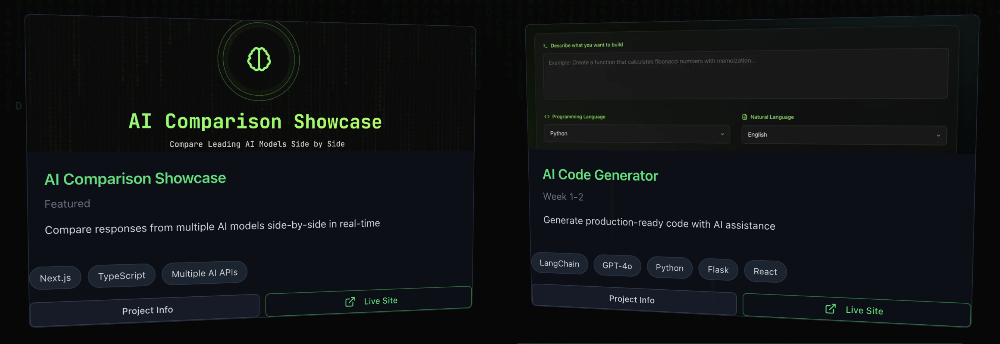
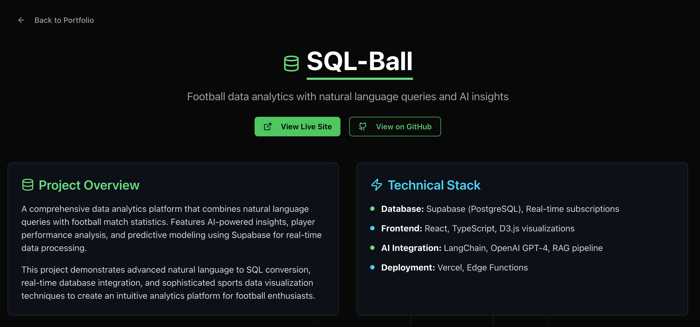

# Mastering Generative AI & Agents Portfolio

Portfolio of AI projects built during the Codecademy 6-week bootcamp (August - September 2025). Demonstrates practical application of LangChain, RAG systems, multi-agent architectures, and modern AI development patterns.

**Live:** https://www.aitomatic.io/

## Projects

### Completed

**AI Comparison Showcase**
- Side-by-side comparison of GPT-4, Claude 3.5, and Gemini responses
- Real-time streaming with response metrics
- Live: https://ai-comparison-showcase.vercel.app

**AI Code Generator**
- Natural language to code with multi-language support
- Automated test generation and documentation
- Live: https://ai-code-generator-rouge.vercel.app/

**SQL-Ball**
- Football data analytics platform with natural language queries
- LangChain to SQL conversion with PostgreSQL backend
- Live: https://sql-ball.vercel.app/

### In Development

- Git Review Assistant (automated PR reviews via LangChain)
- RAG Chatbot (semantic search with Pinecone)
- Multi-Agent System (LangGraph coordination)
- Dev Workflow Agent (MCP integration for automation)

## Tech Stack

- **Frontend:** Next.js 15.5, React 19, TypeScript 5.7
- **Styling:** Tailwind CSS 4.0, Anime.js for animations
- **AI Frameworks:** LangChain 0.3, OpenAI API, Anthropic API
- **Backend:** Node.js, PostgreSQL, Supabase
- **Infrastructure:** Vercel, GitHub Actions

## License

MIT License - see [LICENSE](LICENSE) file
